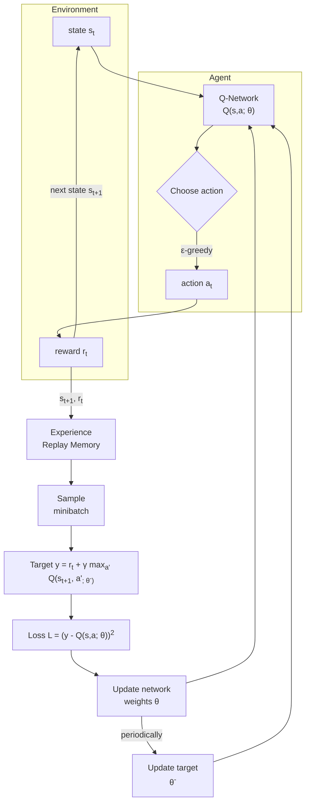
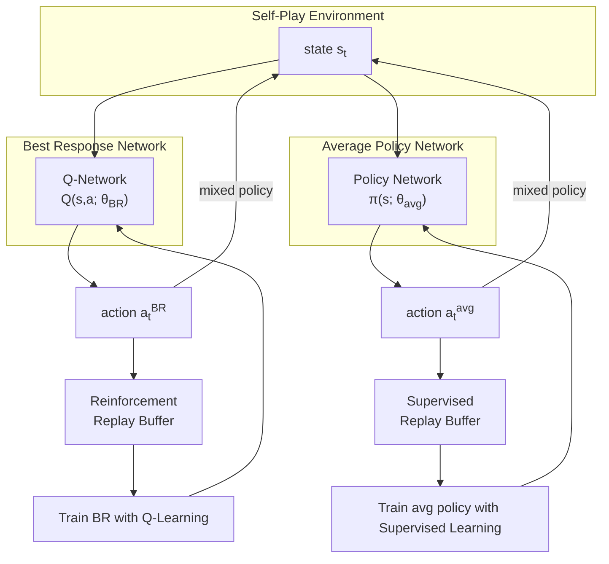
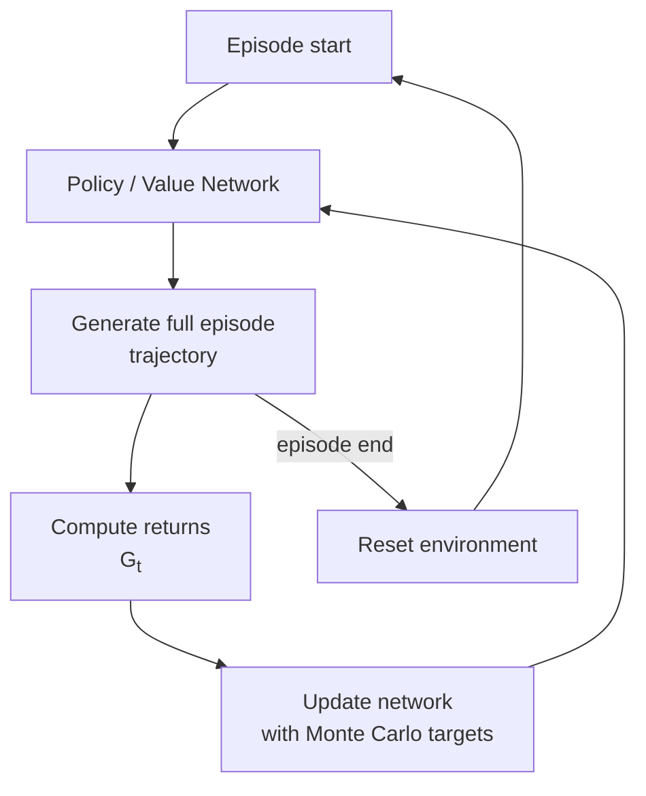

# Algorithm Diagrams

## Deep Q-Network (DQN)

```mermaid
flowchart TD
    subgraph ENV[Environment]
        S["state s<sub>t</sub>"]
        R["reward r<sub>t</sub>"]
    end

    subgraph AGENT[Agent]
        Q["Q-Network<br/>Q(s,a; θ)"]
        Choice{Choose action}
        Act["action a<sub>t</sub>"]
    end

    Replay["Experience<br/>Replay Memory"]
    Batch["Sample<br/>minibatch"]
    Target["Target y = r<sub>t</sub> + γ max<sub>a'</sub> Q(s<sub>t+1</sub>, a'<sub>; θ<sup>-</sup>)"]
    Loss["Loss L = (y - Q(s,a; θ))<sup>2</sup>"]
    Update["Update network<br/>weights θ"]
    TargetUpdate["Update target<br/>θ<sup>-</sup>"]

    S --> Q
    Q --> Choice
    Choice -->|ε-greedy| Act
    Act --> R
    R -->|s<sub>t+1</sub>, r<sub>t</sub>| Replay
    R -->|next state s<sub>t+1</sub>| S
    Replay --> Batch
    Batch --> Target
    Target --> Loss
    Loss --> Update
    Update --> Q
    Update -->|periodically| TargetUpdate
    TargetUpdate --> Q
```

## Neural Fictitious Self Play (NFSP)

```mermaid
flowchart TD
    subgraph ENV[Self-Play Environment]
        State["state s<sub>t</sub>"]
    end

    subgraph BR[Best Response Network]
        BRNet["Q-Network<br/>Q(s,a; θ<sub>BR</sub>)"]
    end

    subgraph AVG[Average Policy Network]
        AvgNet["Policy Network<br/>π(s; θ<sub>avg</sub>)"]
    end

    aBR["action a<sub>t</sub><sup>BR</sup>"]
    aAvg["action a<sub>t</sub><sup>avg</sup>"]
    ReplayQ["Reinforcement<br/>Replay Buffer"]
    ReplaySL["Supervised<br/>Replay Buffer"]
    TrainQ["Train BR with Q-Learning"]
    TrainSL["Train avg policy with Supervised Learning"]

    State --> BRNet
    State --> AvgNet
    BRNet --> aBR
    AvgNet --> aAvg
    aBR --> ReplayQ
    aAvg --> ReplaySL
    ReplayQ --> TrainQ
    ReplaySL --> TrainSL
    TrainQ --> BRNet
    TrainSL --> AvgNet
    aBR -->|mixed policy| State
    aAvg -->|mixed policy| State
```

## Deep Monte Carlo (DMC)

```mermaid
flowchart TD
    Start["Episode start"]
    Network["Policy / Value Network"]
    Trajectory["Generate full episode<br/>trajectory"]
    Returns["Compute returns<br/>G<sub>t</sub>"]
    UpdateMC["Update network<br/>with Monte Carlo targets"]
    Reset["Reset environment"]

    Start --> Network
    Network --> Trajectory
    Trajectory --> Returns
    Returns --> UpdateMC
    UpdateMC --> Network
    Trajectory -->|episode end| Reset
    Reset --> Start
```
